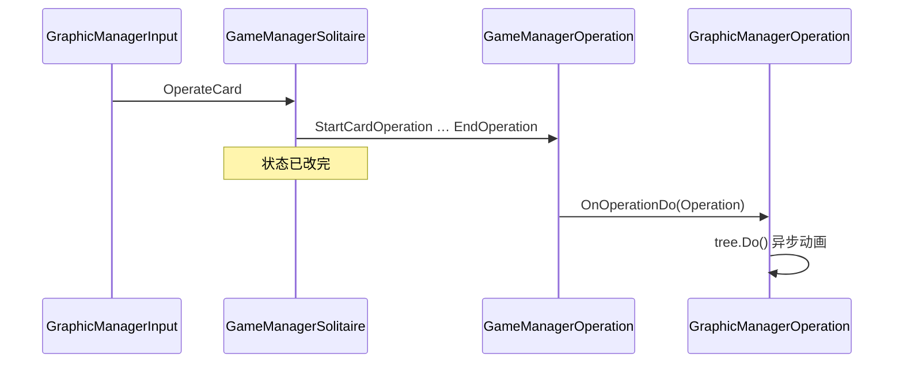

# Solitaire 玩法：逻辑与表现分离（讨论沉淀 · 初版）

> **文档用途**：供人与 AI 快速理解本项目中纸牌玩法的「逻辑 / 表现」架构、一次点击与撤销的完整链路，以及 `Operation` / `OperateData` / `GraphicOperateTree` 等核心概念。  
> **初版范围**：基于代码阅读与架构讨论整理，非 API 全集。  
> **代码根目录**（Unity 工程内）：`client/Assets/Game/Solitaire/`  
> **工程内更全的模块文档**：`client/Assets/Game/Solitaire/SOLITAIRE_CONTEXT.md`  
> **与 Merge 对比**：Solitaire 为「双 Main + Operation 回放」；Merge 为 Logic → Bridge → Graphic（ECS）。

---

## 文档维护说明（给后续 AI）

- 本文是**初版**，新结论请追加到文末 **「变更记录」**，并在正文相应章节增补，避免整篇重写。
- 改代码后若与本文冲突，**以代码为准**，并更新本文。
- 引用代码时优先写**相对路径**（相对 `client/Assets/Game/Solitaire/`）。

---

## 1. 核心机制（三句话）

1. **逻辑层**：点击后**同步**修改 `CardSlot` / `CardGroup`（`ChangeGroup`、翻牌、扣点、Combo 状态等）。逻辑是**唯一权威状态**。
2. **`GameManagerOperation`**：在同一帧、同一次「操作边界」内，把变更记成**一条** `Operation`（内含多条 `OperateData`），写入栈 `operations`，并触发 `OnOperationDo`。
3. **表现层**：订阅 `OnOperationDo`，用 `GraphicOperateTree` + `CommandCenter` **回放**该 `Operation`（DOTween / CmdMove），**不反向改逻辑**。

输入为**点击**（非拖拽移牌）；拖拽仅可能出现在教程引导表现中。

---

## 2. 架构总览

### 2.1 双 Main

| 层 | 入口 | 命名空间 | 职责 |
|----|------|----------|------|
| 逻辑 | `Scripts/Runtime/Game/Main.cs` | `Solitaire.Game` | 规则、状态、存档（IRWType）、AI、动态难度 |
| 表现 | `Scripts/Runtime/Graphic/Main.cs` | `Solitaire.Graphic` | 场景、预制体、输入射线、动画命令队列 |

FSM `SolitaireState_Loading` 同时 `Init` 两边；`SolitaireState_Playing` 每帧分别 `Game.Main.Update` / `Graphic.Main.Update`。

### 2.2 逻辑分组（非经典 Klondike 命名）

| CardGroup | 职责 |
|-----------|------|
| Desktop | 桌面牌堆 |
| Hand | 手牌 / 抽牌堆 |
| SlotMaster | 主接龙槽 |
| SlotStandby | 副槽 |
| Temp | 弃牌 / 临时区 |

### 2.3 入口与 FSM

- `Scripts/GameMgr.cs`：`EnterGame(ISolitaireProxyBase)` → `SceneManager` FSM 进 Solitaire 场景。
- 典型状态：`Init` → `Loading`（`Game.Main.Init` + `Graphic.Main.Init`）→ `Playing`（双 `Update`）→ `Pause` / `Finish` / `HangOn` 等。
- **续关**（`IsResume`）：`Main.Start()` **不**走 `StartEnterOperation`，避免重复入场 Operation。

### 2.4 连接方式

| 机制 | 作用 |
|------|------|
| `ISolitaireProxyBase` | 关卡参数注入（关卡 id、`NodeInfoCollection` 等） |
| `Deck` | 建牌、槽位事件中枢（`OnSlotMove`、翻牌、子牌增减…） |
| `GameManagerOperation` | **操作日志**：单向监听 Deck / `OnSlotOperationStart`·`End`，写入 `operations` |
| `OnOperationDo` / `OnOperationUnDo` | `Action<Operation>`，整包 Operation 完成或撤销时广播 |
| `CardSlot.InstanceId` | 逻辑槽 ↔ `GraphicCardSlot` |
| 平行类 | `Card_*`（逻辑）↔ `GraphicCard_*`（表现），按牌型扩展 |
| `MessageDispatch` | 教程、存档、BI 等横切 |

> Combo 等系统除监听 `OnOperationDo` 外，还会在逻辑执行过程中监听 `Deck.OnSlotMove` **先改运行时状态**，再由 `OnCombo` 写入 `AddCombo` 的 `OperateData`（见 §7.5）。

---

## 3. 核心类型：Operation / OperateData / 事件

### 3.1 关系（一对多）

```
一次玩家行为（一次点击、一次道具、入场动画等）
└── Operation（1 条：operationId, canUnDo, sourceType, block…）
    └── operateList[0 .. count-1]（多条 OperateData，原子步骤）
```

- **`operateList`**：即 `Operation` 内的 `OperateData[]`，`count` 为有效条数（上限 64）。
- **一次点击**通常产生 **1 条 `Operation`**，不是多条 `Operation`。
- **`OnOperationDo` 的参数是 `Operation`，不是单个 `OperateData`。**

关键文件：

- `Scripts/Runtime/Game/Operation/Operation.cs`
- `Scripts/Runtime/Game/Operation/OperateData.cs`
- `Scripts/Runtime/Game/Manager/GameManagerOperation.cs`

### 3.2 OperateData 常见类型

`MoveSlot`、`SolitaireStart`、`FlipToFront` / `FlipToBack`、`AddChildCard` / `RemoveChildCard`、`NumberPlus` / `NumberMinus`、`CardNumberChange`、`AddCombo` / `ClearCombo`、`ItemEnter`、`RewardItem` 等。

每条含 `operateDepth`（见 §6）、`operateType`、`slot` / `card`、`from` / `to` 等；Combo 类含 `preState` / `postState`；`parent` 指向所属 `Operation`（运行时，存档用 `slotId` / `cardIndex` 还原）。

### 3.2.1 Operation 来源 `OperateSourceType`

| 值 | 典型场景 | `canUnDo` | `block`（动画） |
|----|----------|-----------|-----------------|
| `CardOperate` | 玩家点牌 | 默认 true | false |
| `Item` | 道具 | 常 false，可配置 | 常 true |
| `EnterAnm` | 开局入场 | false | true |
| `Success` | 关卡成功 | false | true |

`GraphicManagerOperation.RealDoOperation` 按 `sourceType` 分支：`CardOperate` → `tree.Do()`；`EnterAnm` → `OpEnterGame`；`Item` → `ManagerItem.ProxyDo`；`Success` → `OpSuccess`。

### 3.3 OnOperationDo / OnOperationUnDo

- **定义位置**：`GameManagerOperation` 上的 C# **事件**（`Action<Operation>`），不是单一虚函数。
- **发布者**：仅 `GameManagerOperation`（`EndOperation` → Do；`UnDo()` 逻辑回滚后 → UnDo）。
- **订阅者（示例）**：

| 订阅方 | 正向 | 撤销 |
|--------|------|------|
| `GraphicManagerOperation` | `DoOperation` → 建树、`tree.Do()` | `UnDoOperation` → `tree.UnDo()` |
| `Game.Main` | `OnOperated`（存档、教程） | 同左 |
| `ComboService` | `HandleOperateDo`（发奖） | `HandleOperateUnDo`（退奖） |
| `DDHandler`、BI 等 | 各自 handler | — |

含义：**一步 Operation 已完成 / 已撤销**的通知；订阅方自行遍历 `operation.count` 与 `operation[i]`。表现层在 `GraphicCardBase.DoOperation` 里**按节点**处理每个 `OperateData`，不是事件派发到每条 Data。

---

## 4. 一次「操作」的边界：Start / End

由 `GameManagerSolitaire.OperateCard` 包住：

```
OnSlotOperationStart  →  StartCardOperation  →  CurrentOperation 打开
OperateSlot / 逻辑连锁  →  持续 AddOperation(OperateData)
OnSlotOperationEnd    →  EndOperation        →  operations.Add + OnOperationDo + CurrentOperation=null
```

| 阶段 | 含义 |
|------|------|
| **Start～End 之间** | 本次点击产生的所有 `OperateData` 属于**同一条** `Operation` |
| **End 之后** | 下一次点击新建下一条 `Operation` |

**不**再调 `OperateCard` 的连锁（如主槽空自动翻手牌）仍落在**当前** `CurrentOperation` 内，不会新开边界。

`CurrentOperation != null` 时禁止 `UnDo()`（极短窗口，通常同帧结束）。

---

## 5. 一次点击：逻辑修改与表现驱动

### 5.1 输入链（表现 → 逻辑）

```
SolitaireInput.OnPointerDown
  → GraphicManagerInput.OnClick（射线 Card / Tutorial 层，ClickMask 可挡）
  → Game.Main.ManagerInput.OnClickCard(instanceId)   // 外包 CheckHandCardFlipBlocked（手牌教程等）
  → GameManagerSolitaire.OperateCard
```

其他输入：`OnClickUndo` → `UnDo()`；`OnClickSlotStandby` → 对主槽顶牌再 `OperateCard`；命中 `Undo` 物体走撤销。

失败（如桌面不可接龙）：逻辑返回 `false`，表现层 `AnmNoMatchShake` + 音效，**不改状态**。

### 5.2 逻辑入口

`slot.Operatable` → `Group.OperatableCheck` → `OperateSlot(slot, 0)`。

**桌面接龙示例**（`CardBase_Solitaire`）：

1. `SolitaireStart`（depth 0）
2. `MatchedByOther` / `MatchWithOther` → `ChangeGroup(SlotMaster, depth+1)`
3. `ChangeGroup` 内：`OnSlotMove` → `OnSlotRemove` / `OnSlotAdd` → `InvokeSetCardNumber`（副作用多为 depth+1）
4. 盖压翻牌：`RemoveFromDesktop` 循环 `OnFlipToFront`

**手牌示例**：`OnOperateInSlotHand(0)` → `ChangeGroup(SlotMaster, 0)`，通常只记一条 `MoveSlot`（**depth=0**）。

**副槽联动**：桌面接龙时 `MatchedByOther` 可能再产生一条 **同 depth** 的 `MoveSlot`（副槽→主槽），与桌面→主槽的 `MoveSlot` 为兄弟关系。

**可操作策略**：`Operatable` → `Group.OperatableCheck` → 如桌面 `OperateCheckInDesktop()`（`CardMatchFunc` 对主/副槽顶牌）。

状态变更核心：`CardSlot.ChangeGroup`（**先**改 Group 归属，**再** `OnSlotMove` / `OnSlotRemove` / `OnSlotAdd` 等供记录）。

### 5.3 记录与广播

Deck / 槽位事件 → `GameManagerOperation` 在 `CurrentOperation != null` 时 `AddOperation` → `EndOperation` → `operations.Add` + **`OnOperationDo(整条 Operation)`**。

### 5.4 表现回放

```
OnOperationDo
  → GraphicManagerOperation.RealDoOperation
  → GraphicOperateTree.GenerateOperateTree(operation)
  → tree.Do()  // 从 root 递归 DoOperate
  → GraphicCardBase.DoOperation（按 OperateType / from / to 分支动画）
  → CommandCenter + CmdMove 等
```

- `CommandCenter.IsBusy` 或上一条 `Operation.block` 时，新 Operation 可进入 **`operationQueue`**，由 `GraphicManagerOperation.Update` 延后 `RealDoOperation`。
- **不阻止**下一次 `OperateCard` 改逻辑（逻辑可领先于动画）。
- 入场 / 部分道具通过 `GraphicManagerInput.AddLogicMask` 屏蔽点击，与 `IsBusy` 互补。

### 5.5 时序图



---

## 6. operateDepth 与 GraphicOperateTree

### 6.1 operateDepth 含义

- 表示**逻辑调用链深度**，不是 `operateList` 下标。
- 玩家点击：`OperateSlot(slot, 0)` 从 **0** 起。
- `ChangeGroup(..., d)` 的副作用常用 **`d+1`**（`OnSlotRemove` / `OnSlotAdd` / 翻牌等）。
- 更深连锁（特殊牌、道具、`MatchedByOther`）继续 `+1`。

**同一 `Operation` 内多条 `OperateData` 可以有相同 `operateDepth`** → 表示**同一因果层上的并行副作用（兄弟节点）**，例如多张 `FlipToFront`、同层的 `MoveSlot` + `AddCombo`。

逻辑层亦按 depth 区分兄弟（例：`Card_Chocolate` 扫 `CurrentOperation` 时用 `operateDepth` 判断同父）。

### 6.2 GraphicOperateTree（仅表现层）

将一条 `Operation` 的**扁平** `operateList` 按 `operateDepth` 建成**树**，用于动画父子顺序与 `CmdWaitOther`。

建树规则（`GraphicOperateTree.GenerateOperateTree`）：

1. `operation[0]` 为 root。
2. 对 `i = 1 .. count-1`：找 `operateDepth - 1` 的节点为父，`children.Add`。
3. `tempOperateions[depth] = 当前节点`（同 depth **覆盖**字典项，只影响**后续** `depth+1` 找父）。
4. 找不到 `depth-1` 父节点时，该条在 DEBUG 下打错并**不挂树**（`Operate Skip`）。

**典型树形**（桌面接龙，示意）：

```
depth0: SolitaireStart
  └─ depth1: MoveSlot（桌面→主槽）
        ├─ depth2: FlipToFront × N
        ├─ depth2: NumberMinus / AddCombo …
        └─ …
```

**注意**：`depth+1` 子节点挂到「该 depth **最后一条**」节点下；多数副作用与主 `MoveSlot` 同层（depth2 兄弟）或挂在 depth1。

正向 `tree.Do()` 只从 **root** 进入；`SolitaireStart` 等通过 `OpChildren` 再播子节点。

文件：`Scripts/Runtime/Graphic/Operation/GraphicOperateTree.cs`。

### 6.3 同 depth 兄弟的先后顺序

| 环节 | 规则 |
|------|------|
| **写入 `operateList`** | 逻辑**同步执行**时 `AddOperation` 的先后 = 事件触发先后（`ChangeGroup` 内固定顺序、循环 `BottomNodes` / `tempFlipList`、Deck 多订阅者注册顺序等） |
| **`children` 列表** | 按 `operateList` 扫描顺序 `Add`，**无**按 slotId 的二次排序 |
| **正向动画** | 父节点 API 决定：`OpChildren` / `OpCommon` 多为**并行**；`OpChildDelay` 子节点**等父**；`OpAddComboDelay` **递增 delay**；特殊牌 `OpScissors` / `OpPinWheel` / `OpNumberConnectMove` 等按类型错开时间 |
| **逻辑撤销** | `Operation.UnDo` 对**扁平列表倒序**，兄弟 **后进先出** |
| **表现撤销** | `OpUnDoChildren` 对 `children` **倒序** |

---

## 7. 连续点击与撤销栈

### 7.1 如何避免 Operation 混乱

- 单次 `OperateCard` **同步**跑完 Start→End，`CurrentOperation` 在返回前已清空。
- 第二次点击是**新的** `OperateCard` → **新的** `Operation` 追加到 `operations` 尾部。
- **不会**把两次点击的 `OperateData` 混进同一 `Operation`（除非仍在同一 Start～End 内，如自动翻手牌）。

### 7.2 撤销什么

- `operations` 为按时间顺序的 **`List<Operation>`**（可存档）。
- **撤销 1 次** = 弹出**栈顶 1 条** `Operation`，对该条内所有 `OperateData` **`UnDoOperate` 倒序**执行。
- `canUnDo == false` 的条目（入场 `EnterAnm`、结算 `Success`、部分道具）：`UnDo()` 时从 `operations` **弹出并回收到对象池**，**不调用** `Operation.UnDo()`，故不恢复状态。

### 7.3 撤回到关卡开始

| 内容 | 是否在栈中 |
|------|------------|
| `Init(levelData)` 初始布局 | 否 |
| 开局入场 `StartEnterOperation` | 是，但 `canUnDo=false`，撤销时跳过 |
| 玩家每步卡牌操作 | 是，`canUnDo=true`（默认） |

`operations.Count == 0` 时 `UnDo()` 返回 `false`，UI 禁用撤销（`TryDispatchUnDoUpdateMessage`）。

另有 **`LogicUnDo()`**：仅逻辑、**不**触发 `OnOperationUnDo`（AI / 模拟用）。

撤销时 `GroupSlotMaster.SetAutoCheck(false)`，避免主槽空时自动翻手牌干扰中间态。

### 7.4 逻辑撤销 vs 表现撤销

| 层 | 正向 | 反向 |
|----|------|------|
| 逻辑 | 点击时直接 `ChangeGroup` 等 | `Operation.UnDo` → `UnDoOperate`（`MoveSlot` 用 `ChangeGroup` 回原组；`Flip` 在逻辑 UnDo 中常为空操作，靠 `MoveSlot` 逆移带起 `AddToDesktop` / `RemoveFromDesktop` 翻牌） |
| 表现 | `DoOperation` / `AnmXxx` | `UnDoOperation` / `AnmXxxUnDo` |
| Combo 经济 | `HandleOperateDo` | `HandleOperateUnDo` |

**不是**从 `OnOperationDo` 自动推导反向；是成对实现。逻辑撤销走**扁平倒序**，与树结构无关。

### 7.5 ComboService.Restore

- **不是**读 Profile 盘存档；`ComboService.State` 随局内 `Operation` 存档（IRWType）可持久化，但 `Restore` 用的是 **`OperateData` 内嵌的 `preState` 快照**。
- **正向**：`Deck.OnSlotMove` → `ProcessHit` / `ProcessReset` 更新 `State` → `OnCombo` / `OnComboClear` 写入 `AddCombo` / `ClearCombo` 的 `OperateData`。
- **撤销**：`UnDoOperate` 调 `Restore(preState)`（恢复 `State` + `sutisArray` 弹尾）；`HandleOperateUnDo` 对 `AddCombo` 做 `RemoveRewards` 等，与逻辑状态分离的经济回滚。

文件：`Scripts/Model/Combo/ComboService.cs`。

### 7.6 存档与 `OnOperated`

- `operations` 列表可随 `Game.Main` **IRWType** 存档，续关后逻辑状态与操作栈一致。
- `Main.OnOperated`：`EnterAnm` / `Success` **不触发**延迟存档；手牌 `MoveSlot` 等会 `Dispatch` 教程事件。

---

## 8. 关键类速查

| 类 / 文件 | 职责 |
|-----------|------|
| `GameManagerSolitaire` | 棋盘、`OperateCard` / `UnDo` |
| `GameManagerOperation` | 记录 `Operation`、事件、`operations` 栈 |
| `CardSlot.ChangeGroup` | 逻辑状态变更 + 事件源 |
| `CardMatchFunc` | 匹配规则表 |
| `ManagerInput` | 逻辑侧点击入口 |
| `GraphicManagerInput` | 射线、调逻辑 |
| `GraphicManagerOperation` | 订阅 Do/UnDo、命令队列 |
| `GraphicOperateTree` / `GraphicOpNode` | 表现层操作树 |
| `GraphicCardBase` | 按 `OperateType` 播动画 |
| `CommandCenter` | 动画批处理、`IsBusy` |

---

## 9. FAQ（讨论中的疑问 Consolidated）

| 问题 | 答案 |
|------|------|
| `OnOperationDo` 与 `Operation` / `OperateData` 关系？ | 事件参数是**整条 `Operation`**；`OperateData` 是其子步骤数组。 |
| `OnOperationDo` 每步执行一个 `OperateData`？ | **否**；表现层收到 Operation 后自行建树并遍历节点。 |
| `operateList` 是否多个 `OperateData`？ | **是**。 |
| 一次点击几个 `Operation`？ | 通常 **1**。 |
| 快速连点会乱吗？ | 逻辑按次 Start/End 分条入栈；动画可能落后逻辑。 |
| 撤销撤几条？ | 每次 **1 条 `Operation`**（内含多 Data）。 |
| `GraphicOperateTree` 在逻辑层吗？ | **否**，仅 Graphic。 |
| 同 depth 能否重复？ | **能**，表示兄弟；顺序见 §6.3。 |
| 动画顺序是否等于兄弟列表顺序？ | **不一定**；常并行，部分 API 串行/错开。 |
| 与 Merge 差异？ | Solitaire：Operation 回放；Merge：ECS + Bridge。 |
| `UnDoOperate` 是否改数据？ | **是**，对 `operateList` 倒序做逆操作（如 `ChangeGroup` 回原组）。 |
| `OnOperationUnDo` 是否 Do 的反射？ | **意图对称**，但是独立实现的 `UnDoOperation` / `AnmXxxUnDo`，非自动生成。 |

---

## 10. 文档审查说明（相对本次讨论）

### 10.1 覆盖情况

| 讨论主题 | 文档位置 |
|----------|----------|
| 双 Main、逻辑/表现分离、三句话机制 | §1–2 |
| 点击全链路、ChangeGroup、失败抖动 | §5 |
| Operation / OperateData / 事件模型 | §3 |
| Start/End 边界、连点分条入栈 | §4、§7.1 |
| 撤销栈、canUnDo、撤到开局、LogicUnDo、SetAutoCheck | §7.2–7.4 |
| GraphicOperateTree、同 depth 兄弟、顺序、并行/串行 | §6 |
| Combo Restore vs 发奖、Flip 逻辑 UnDo 空操作 | §7.4–7.5 |
| 与 Merge 对比、点击非拖拽 | §1、FAQ |
| GameMgr/FSM、OperateSourceType、operationQueue | §2.3–3.2.1、§5.4 |

### 10.2 初版未展开（见 §11 待扩展，非讨论遗漏）

- 完整目录树、26 种牌型清单、FSM 全状态表（见 `SOLITAIRE_CONTEXT.md`）。
- 各特殊牌完整 `operateList` 样例、道具全链路。
- `canUnDo=false` 条目被连续撤销弹尽后 `operations` 为空的边界（代码 `while` 依赖栈内仍有可撤项；仅剩入场条时需靠 `Count==0` 判断）。

### 10.3 阅读预期

- **能理解**：架构原则、一次点击与一次撤销的数据流、Operation 与 OperateData 关系、树与兄弟顺序、常见 FAQ。
- **需结合代码或 §11**：具体牌型动画名、教程/遮罩矩阵、编辑器与关卡工具。

---

## 11. 待扩展（留给后续 AI / 人）

- [ ] 各 `NodeType` 特殊牌一次 Operation 的 `operateList` 样例
- [ ] 道具 `Item` 的 `Operation` 与 `GraphicManagerItem.ProxyDo` 链路
- [ ] `OperationEventLock`、输入 `ClickMask` 完整矩阵
- [ ] 存档恢复后 `operateList` 与表现 Resync
- [ ] `depth+1` 父节点挂错风险的回归用例

---

## 变更记录

| 日期 | 摘要 |
|------|------|
| 2026-05-24 | 初版：逻辑/表现分离、点击与撤销链路、Operation/OperateData/事件、操作边界、GraphicOperateTree、同 depth 兄弟顺序、Combo Restore、FAQ |
| 2026-05-24 | 审查修订：补 GameMgr/FSM/Resume、OperateSourceType、operationQueue/block、输入与遮罩、副槽/手牌 depth、Combo 双通道、建树 skip、§10 审查说明 |
